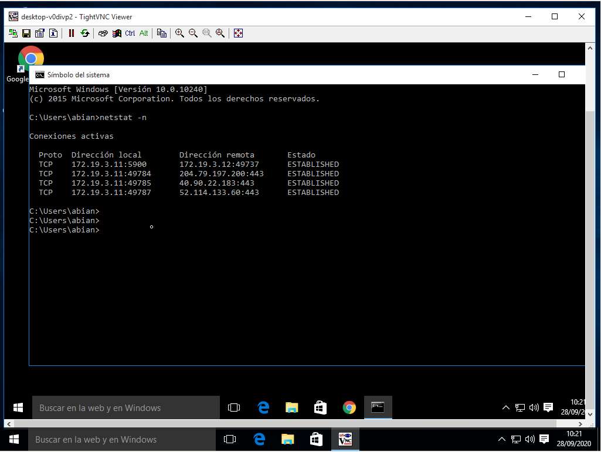

# Práctica 1 - VNC

###### Nombre del alumno:
Abián Castañeda Méndez

##### 2.1 Comprobaciones finales
Tras haber configurado la máquina siguiendo. Tendremos que conectarnos desde Window Master hacia el Windows Slave. Tendremos que ir al servidor VNC y usar el comando **netstat -n** para ver las conexiones VNC con el cliente.

