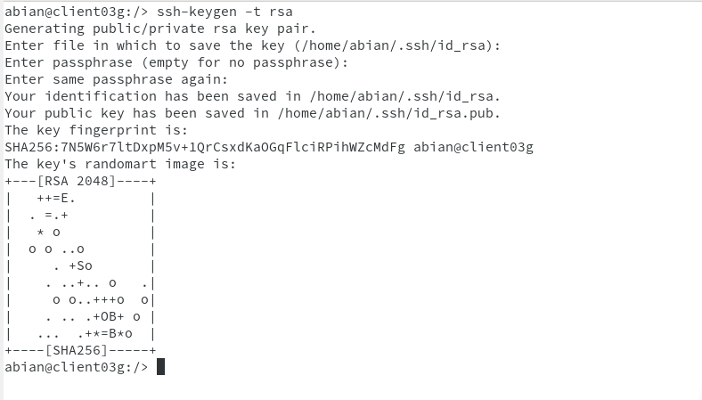

# Práctica 2 - Acceso remoto con SSH

###### Nombre del alumno:
Abián Castañeda Méndez

##### 2.1 Primera conexión SSH desde cliente GNU/Linux

Tendremos que ir al cliente (**client03g**). Allí haremos ping al  (**server03g**) con el fin de comprobar la conectividad con el servidor. Después comprobaremos que los puertos del servidor estén abiertos con el comando **nmap -Pn server03g**, en especial el puerto 22 (SSH debe estar open). Si esto falla, debemos comprobar en el servidor la configuración del cortafuegos. En mi caso no me dio fallos.

Vamos a comprobar el funcionamiento de la conexión SSH desde cada cliente usando el usuario **castaneda1**. Desde el cliente GNU/Linux nos conectamos mediante **ssh castaneda1@server03g**.

A partir de ahora cuando nos conectamos sólo nos pide la contraseña:

Por último en este apartado, comprobaremos el contenido del fichero **$HOME/.ssh/known_hosts** en el equipo cliente. La clave que aparece es la identificación de la máquina del servidor. Una vez llegados a este punto deben de funcionar correctamente las conexiones SSH desde el cliente.

##### 3.2 Comprobamos

En este apartado comprobamos qué sucede al volver a conectarnos desde los dos clientes tras haber realizado los apartados anteriores, usando los usuarios **castaneda2 y castaneda1**.

**OpenSUSE**

**Windows**

Para solucionarlo solo tendremos que leer los mensajes de advertencia donde en la antepenúltima linea nos indica que comando usar para solucionar el error.

##### 5. Autenticación mediante claves públicas

El objetivo de este apartado es el de configurar SSH para poder acceder desde el **client03g** sin necesidad de escribir la clave. Usaremos un par de claves pública/privada.

Para ello, vamos a configurar la autenticación mediante clave pública para acceder con nuestro usuario personal desde el equipo cliente al servidor con el usuario **castaneda4**.

Vamos a la máquina **client03g** (No usar el usuario root). Iniciamos sesión con nuestro el usuario **nombre-alumno de la máquina client03g**. Con el comando **ssh-keygen -t rsa** podremos generar un nuevo par de claves para el usuario en:

* /home/nombre-alumno/.ssh/id_rsa
* /home/nombre-alumno/.ssh/id_rsa.pub

Ahora vamos a copiar la clave pública **(id_rsa.pub)**, al fichero **"authorized_keys"** del usuario remoto **castaneda4** que está definido en el servidor. Para ello usaremos el comando **ssh-copy-id castaneda4@server03g**

por último comprobaremos que ahora al acceder remotamente vía SSH

* Desde **client03g**, NO se pide password.

* Desde **clientXXw**, SI se pide el password.

##### 6. Uso de SSH como túnel para X

Instalar en el servidor una aplicación de entorno gráfico **(APP1)** que no esté en los clientes. Por ejemplo Geany.

Modificar servidor SSH para permitir la ejecución de aplicaciones gráficas, desde los clientes. Consultar fichero de configuración **/etc/ssh/sshd_config (Opción X11Forwarding yes)**. Después tendremos que reiniciar el servicio SSH para que se lean los cambios de configuración.

* Vamos a **client03g**.

Usaremos el comando **zypper se APP1** para comprobar que no está instalado el programa APP1. Después comprobaremos desde **client03g**, que funciona APP1(del servidor). Con el comando **ssh -X castaneda1@server03g**, nos conectamos de forma remota al servidor, y ahora ejecutamos APP1 de forma remota.

##### 8.1 Restricción sobre un usuario

Vamos a crear una restricción de uso del SSH para un usuario:

En el servidor tenemos el usuario **castaneda2**. Desde local en el servidor podemos usar sin problemas el usuario.Vamos a modificar SSH de modo que al usar el usuario por SSH desde los clientes tendremos permiso denegado.

Para ello tenemos que consultar/modificar el fichero de configuración del servidor SSH (**/etc/ssh/sshd_config**) para restringir el acceso a determinados usuarios.

Con el comando **/usr/sbin/sshd -t; echo $?**, comprobaremos si la sintaxis del fichero de configuración del servicio SSH es correcta (Respuesta 0 => OK, 1 => ERROR). Por último solo nos faltaría comprobar la restricción al acceder desde los clientes.

