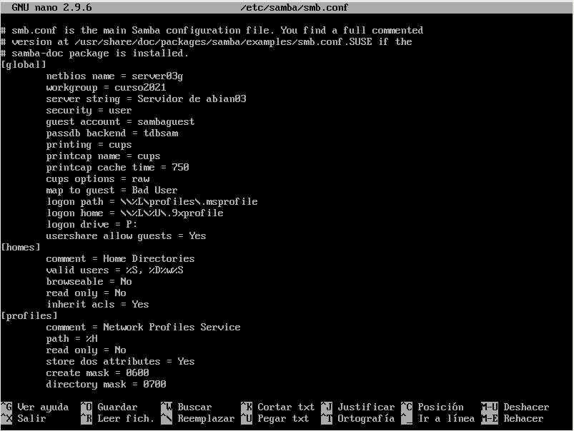

# Práctica 3 - Samba (OpenSUSE y Windows)

###### Nombre del alumno:
Abián Castañeda Méndez

### 1.4 Configurar el servidor Samba

Primero de todo tendremos que hacer una copia de seguridad del fichero de configuración antes de modificarlo. Para ello usaremos el comando **"cp /etc/samba/smb.conf /etc/samba/smb.conf.bak"**

Para instalar y configurar el servicio Samba, usaremos el entorno gráfico. Como estamos en OpenSUSE vamos a usar Yast.

Allí nos dirigimos a **Yast -> Samba Server**. Seleccionamos **Workgroup: curso2021**, sin controlador de dominio. En la pestaña de Inicio definimos

* Iniciar el servicio durante el arranque de la máquina.

* Ajustes del cortafuegos -> Abrir puertos

Para descartar un problema del servidor Samba con el cortafuegos, usaremos el comando **nmap -Pn 172.19.3.31** desde otra máquina GNU/Linux. Los puertos SMB/CIFS (139 y 445) deben estar abiertos.

### 1.5 Crear los recursos compartidos de red

Vamos a configurar los recursos compartidos de red en el servidor mediante el fichero de configuración. Para ello usaremos el comando **"nano /etc/samba/smb.conf"**

Para verificar la sintaxis del fichero de configuración usaremos **"testparm"**.

### 2.1 Cliente Windows GUI

Desde un cliente Windows vamos a acceder a los recursos compartidos del servidor Samba. Para ello escribimos \\\172.19.3.31 y vemos lo siguiente:

Accederemos con los distintos usuarios a sus respectivas carpetas para después ver las conexiones abiertas. En este caso lo probé con castillo y users.

Por último accedí al recurso compartido con el usuario pirata, después fuí al servidor Samba y hice lo siguiente:

* smbstatus
* lsof -i

### 2.2 Cliente Windows comandos

Abriremos una shell de windows. Después usaremos el comando **net use** para consultar todas las conexiones/recursos conectados. Con **net use /?**, podemos consultar la ayuda.

Si hubiera alguna conexión abierta la cerramos. Con **net use * /d /y** cerramos las conexiones SMB y con **net use** ahora vemos que NO hay conexiones establecidas.

**net view \\172.19.3.31**, para ver los recursos de esta máquina. Montar el recurso barco de forma persistente. Con **net use S: \\172.19.3.31\barco pirata01  /USER:pirata1 /p:yes** crearemos una conexión con el recurso compartido y lo montaremos en la unidad S. Con la opción /p:yes hacemos el montaje persistente. De modo que se mantiene en cada reinicio de máquina. Con **net use**, comprobamos. Ahora podemos entrar en la unidad S ("s:") y crear carpetas, etc.

Con estos comandos comprobaremos los resultados:

* smbstatus, desde el servidor Samba.

* lsof -i, desde el servidor Samba.

### 3.1 Cliente GNU/Linux GUI

Desde en entorno gráfico, podemos comprobar el acceso a recursos compartidos SMB/CIFS. Accedemos al recurso prueba del servidor Samba, pulsamos CTRL+L y escribimos smb://172.19.3.31. Probamos a crear carpetas/archivos en castillo y en barco y comprobamos que el recurso public es de sólo lectura.

Con estos comandos comprobaremos los resultados:

* smbstatus, desde el servidor Samba.

* lsof -i, desde el servidor Samba.

### 3.2 Cliente GNU/Linux comandos

Vamos a un equipo GNU/Linux que será nuestro cliente Samba. Desde este equipo usaremos comandos para acceder a la carpeta compartida. Probaremos esto desde OpenSUSE: **smbclient --list 172.19.3.31**, con esto mostraremos los recursos SMB/CIFS de un equipo. Después crearemos en local la carpeta /mnt/remotoXX/castillo.

Con el usuario root, usamos el siguiente comando para montar un recurso compartido de Samba Server, como si fuera una carpeta más de nuestro sistema: **mount -t cifs //172.19.3.31/castillo /mnt/remoto03/castillo -o username=soldado1**.

Para comprobar que el recurso ha sido montado, usamos el comando **df -hT**.

Por último con estos comandos comprobaremos los resultados:

* smbstatus, desde el servidor Samba.

* lsof -i, desde el servidor Samba.

### 3.3 Montaje automático

Usamos el df -hT y comprobamos que el recurso anterior ya no está montado.

Para configurar acciones de montaje automáticos cada vez que se inicie el equipo, debemos configurar el fichero **/etc/fstab**.

* //smb-server03/public /mnt/client03/public cifs username=soldado1,password=soldado01 0 0

Al reiniciar comprobamos que por algún error que desconozco no se realiza el montaje automático.

