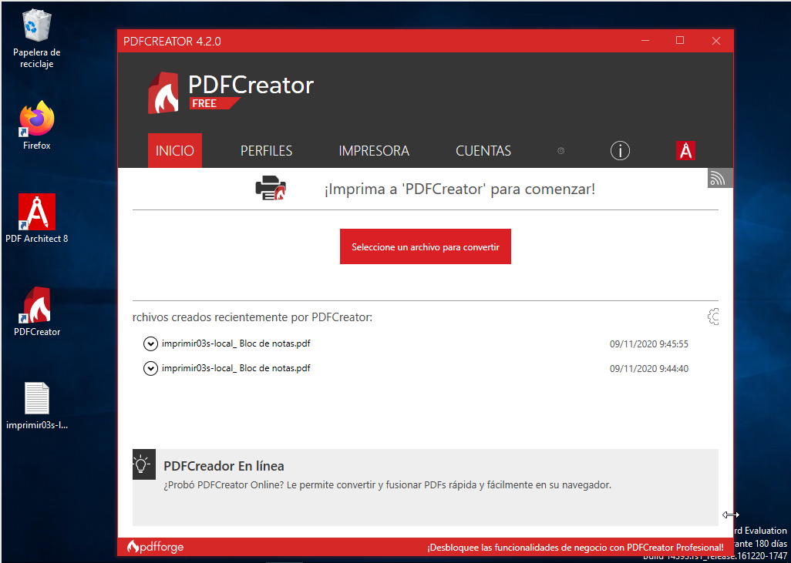
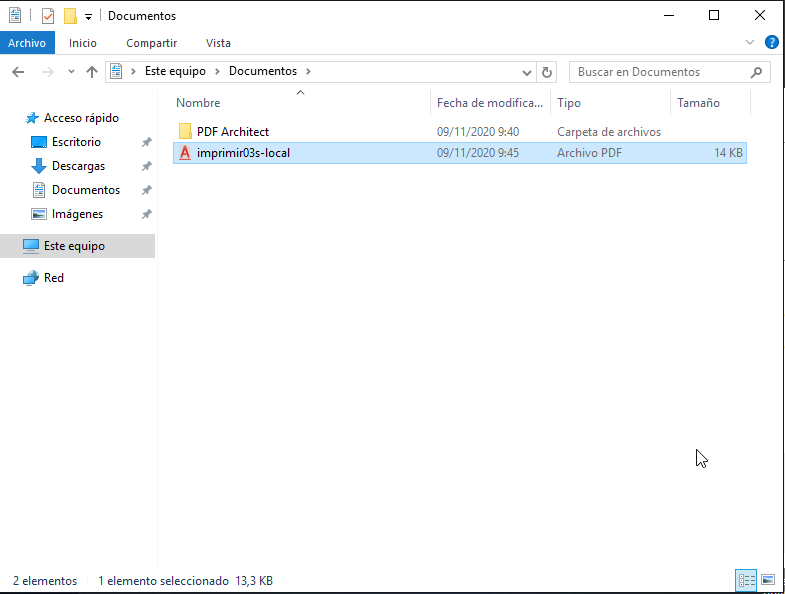
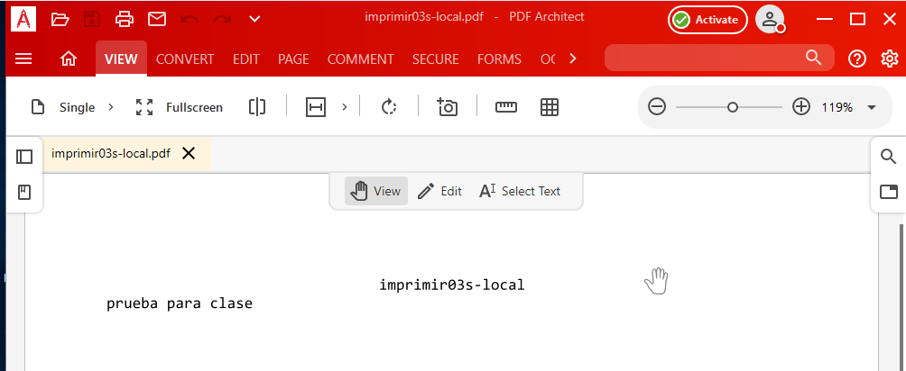
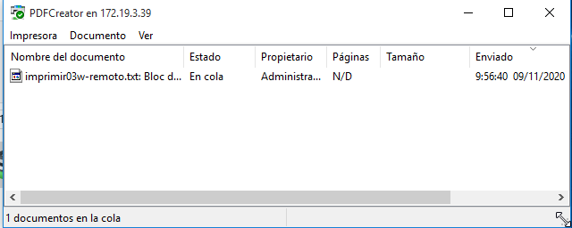
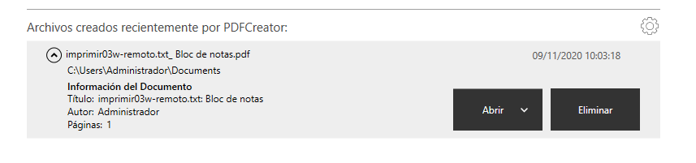
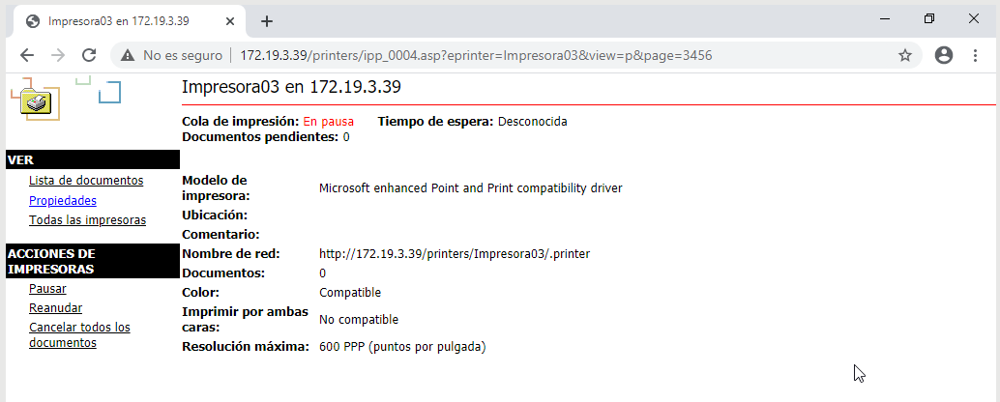
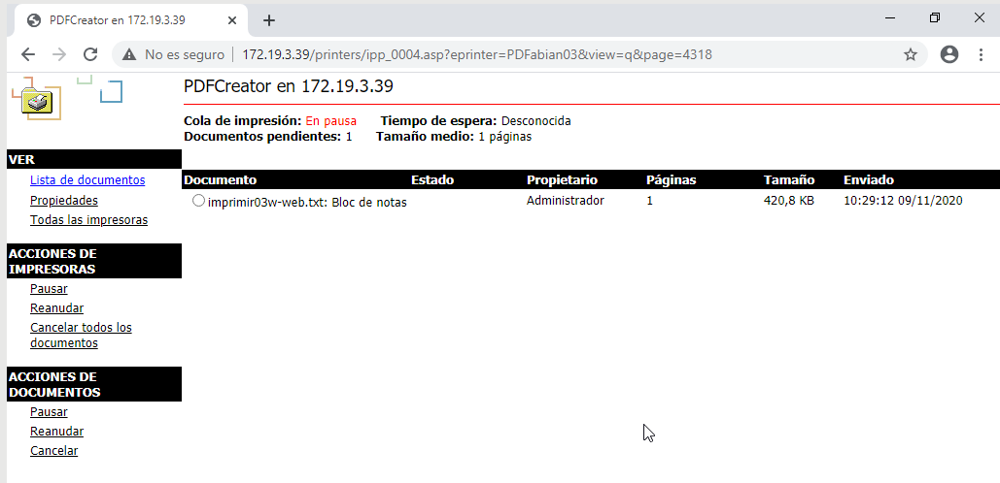
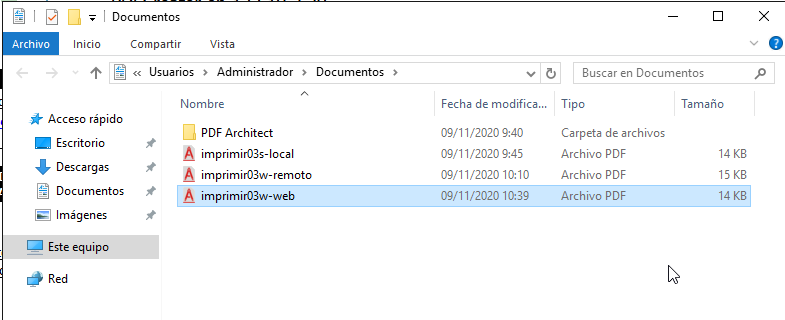

# Práctica 4 - Servidor de Impresión en Windows

###### Nombre del alumno:
Abián Castañeda Méndez

### 1.3 Probar la impresora local

Para crear un archivo PDF no hará falta que cambiemos la aplicación que estemos usando, simplemente vamos a la opción de imprimir y seleccionamos "Impresora PDF", en segundos tendremos creado un archivo PDF.

Probaremos la nueva impresora abriendo el Bloc de notas y creando un fichero, luego seleccionaremos "imprimir". Cuando finalice el proceso se abrirá un fichero PDF con el resultado de la impresión.

* Probar la impresora remota imprimiendo documento imprimir03s-local.

### 2.2 Comprobar desde el cliente

Vamos a la máquina cliente, allí buscamos recursos de red del servidor. Si tarda en aparecer ponemos \\ip-del-servidor  en la barra de navegación.

Seleccionaremos **impresora -> botón derecho -> conectar**. Ponemos usuario/clave del Windows Server. Ya tenemos la impresora remota configurada en el cliente. Probaremos la impresora remota imprimiendo documento imprimir03w-remoto.

### 3.3 Comprobar desde el navegador

Vamos a realizar seguidamente una prueba sencilla en nuestra impresora de red. Primero de todo accedemos a la configuración de la impresora a través del navegador. Pondremos en pausa los trabajos de impresión de la impresora.

Ir a MV cliente. Probar la impresora remota imprimiendo documento **imprimir03w-web**. Comprobar que al estar la impresora en pausa, el trabajo aparece en cola de impresión.

Finalmente pulsa en reanudar el trabajo para que tu documento se convierta a PDF.

