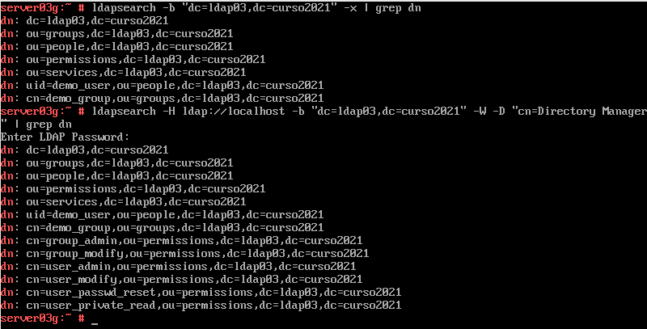
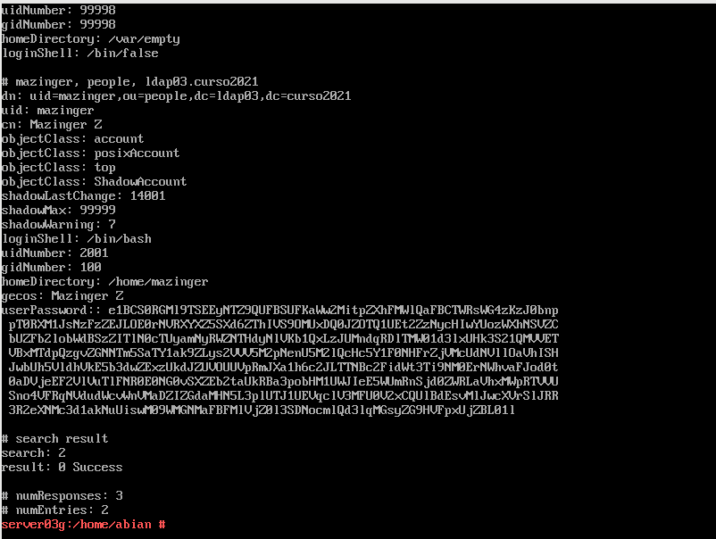
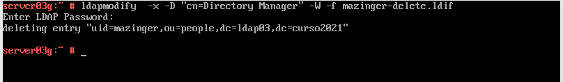
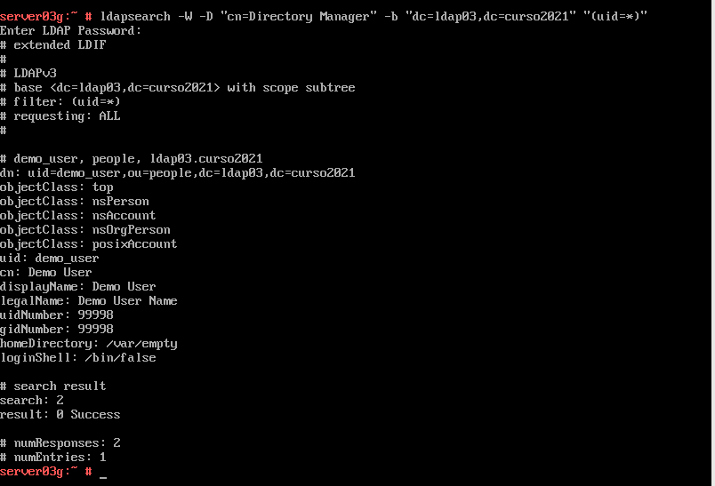
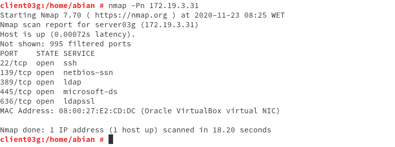
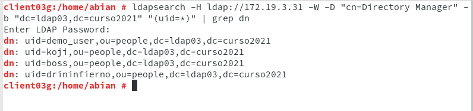

# Práctica 5 - Servidor de Directorio con comandos

###### Nombre del alumno:
Abián Castañeda Méndez

### 2.4 Comprobamos el acceso al contenido del LDAP

Usaremos el comando **ldapsearch -b "dc=ldap03,dc=curso2021" -x | grep dn** con el fin de mostrar el contenido de nuestra base de datos LDAP.

Con **ldapsearch -H ldap://localhost -b "dc=ldap03,dc=curso2021" -W -D "cn=Directory Manager" | grep dn** haremos la consulta usando usuario/clave.

### 3.3 Comprobar el nuevo usuario

Usaremos el comando **ldapsearch -W -D "cn=Directory Manager" -b "dc=ldap03,dc=curso2021" "(uid=*)"** para comprobar si se ha creado el usuario correctamente en el LDAP.

Después de esto crearemos un archivo **mazinger-delete.ldif** con el fin de ejecutar el siguiente comando para eliminar un usuario del árbol LDAP: **ldapmodify -x -D "cn=Directory Manager" -W -f mazinger-delete.ldif**

Veremos como el usuario "Mazinger" ya no existe.

### 4.3 Comprobar los usuarios creados

Iremos a la MV cliente LDAP. Allí ejecutaremos **nmap -Pn 172.19.3.31**, tendremos que comprobar que el puerto LDAP del servidor está abierto. Si no aparecen los puertos abiertos, entonces revisar el cortafuegos.

Por último ejecutamos **ldpasearch -H ldap:///172.19.3.31 -W -D "cn=Directory Manager" -b "dc=ldap03,dc=curso2021" "(uid=*)" | grep dn** para consultar los usuarios LDAP que tenemos en el servicio de directorio remoto.

