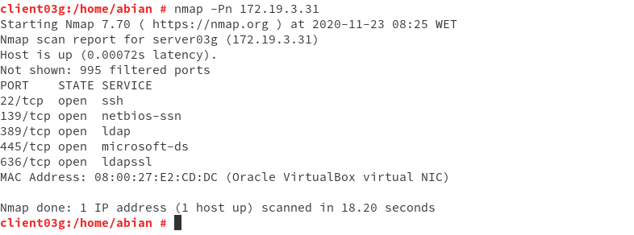
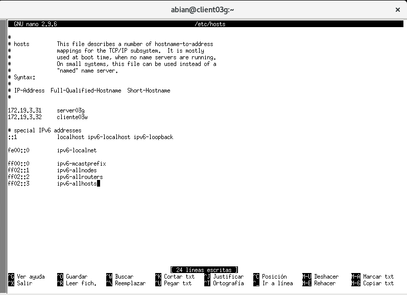
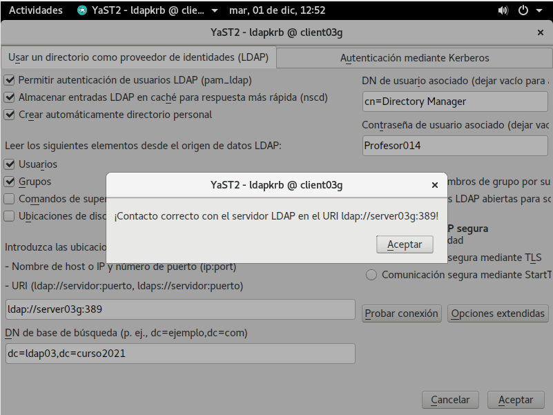
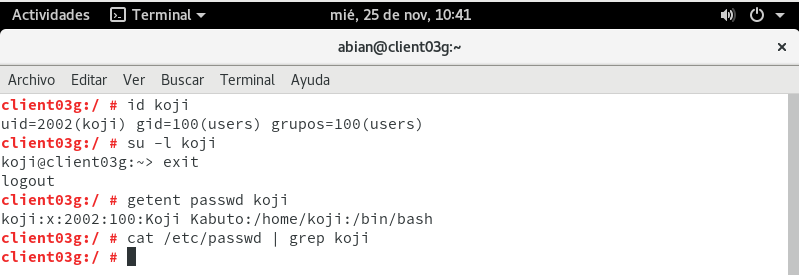

# Práctica 6 - Autenticación con 389-DS

###### Nombre del alumno:
Abián Castañeda Méndez

## 1. Preparativos

Comprobaremos el acceso al LDAP desde el cliente:

**nmap -Pn 172.19.3.31**, para comprobar que el servidor LDAP es accesible desde la MV2 cliente.

**ldapsearch -H ldap://172.19.3.31 -W -D "cn=Directory Manager" -b "dc=ldap03,dc=curso2021" "(uid=*)" | grep dn**, comprobamos que los usuarios del LDAP remoto son visibles en el cliente.

## 2. Configurar autenticación LDAP
### 2.1 Crear conexión con servidor

Vamos a configurar la conexión del cliente con el servidor LDAP. Iremos a la MV cliente y nos aseguraremos de tener bien el nombre del equipo y nombre de dominio **(/etc/hostname, /etc/hosts)**.

Después iremos a **Yast -> Cliente LDAP y Kerberos** y allí configuraremos con lo siguiente:

* BaseDN: dc=ldap03,dc=curso2021

* DN de usuario: cn=Directory Manager

* Contraseña: CLAVE del usuario

### 2.2 Comprobar con comandos

Vamos a la consola con usuario root, y probamos lo siguiente:

