# Práctica 7 - Vagrant con VirtualBox

###### Nombre del alumno:
Abián Castañeda Méndez

## 3. Proyecto Celtics
### 3.3 Comprobar

Vamos a crear una MV nueva y la vamos a iniciar usando Vagrant. Debemos estar dentro de **vagrant03-celtics**. Usaremos el comando **vagrant up**, para iniciar una nueva instancia de la máquina y **vagrant ssh** para conectar/entrar en nuestra máquina virtual usando SSH.

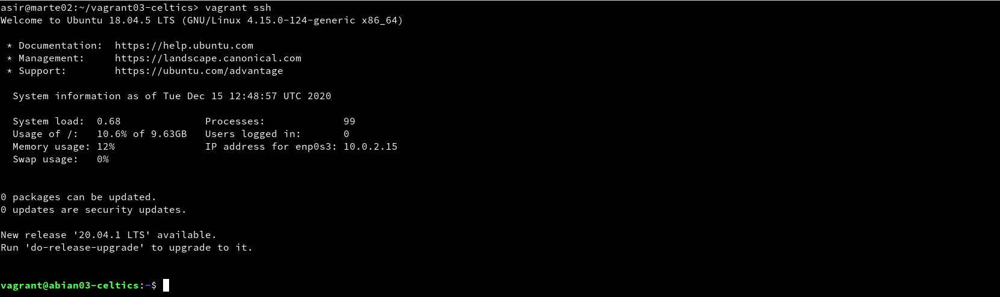

## 5. Proyecto Hawks
### 5.2 Comprobar

Para confirmar que hay un servicio a la escucha en 4567, desde la máquina real podemos ejecutar los siguientes comandos

* En el HOST-CON-VAGRANT (Máquina real). Comprobaremos que el puerto 4567 está a la escucha. Usaremos el comando **vagrant port** para ver la redirección de puertos de la máquina Vagrant.

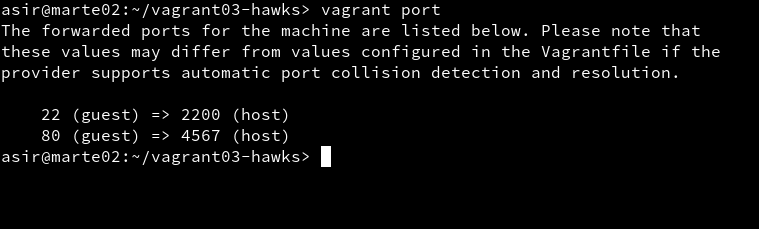

* En HOST-CON-VAGRANT, abrimos el navegador web con el URL **http://127.0.0.1:4567**. En realidad estamos accediendo al puerto 80 de nuestro sistema virtualizado.

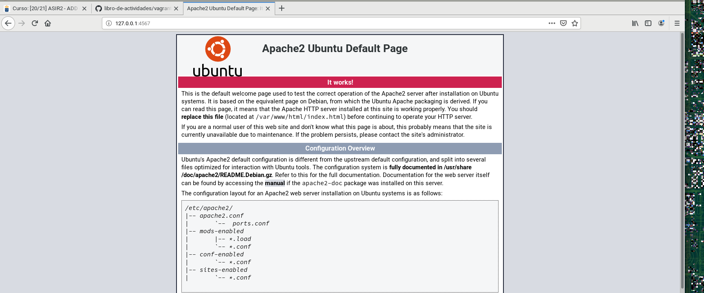

## 6. Suministro
### 6.1 Proyecto Lakers (Suministro mediante shell script)

Ahora vamos a suministrar a la MV un pequeño script para instalar Apache. Crearemos el directorio **vagrant03-lakers** para nuestro proyecto. Después entraremos en dicha carpeta. Crear la carpeta html y crear fichero **html/index.html** con el contenido que nos indica la guía. Después crearemos el script **install_apache.sh**, dentro del proyecto.

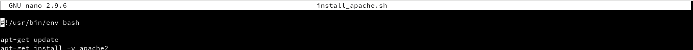

Tras esto, incluiremos la configuración propuesta en la guía en el fichero de configuración **Vagrantfile**.

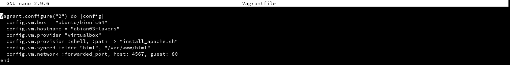

Para verificar que efectivamente el servidor Apache ha sido instalado e iniciado, abrimos navegador en la máquina real con URL **http://127.0.0.1:4567**

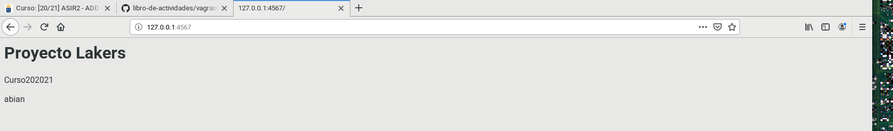

### 6.2 Proyecto Raptors (Suministro mediante Puppet)

En este apartado crearemos el directorio **vagrant03-raptors** como nuevo proyecto Vagrant y modificaremos el archivo **Vagrantfile** de la siguiente forma:

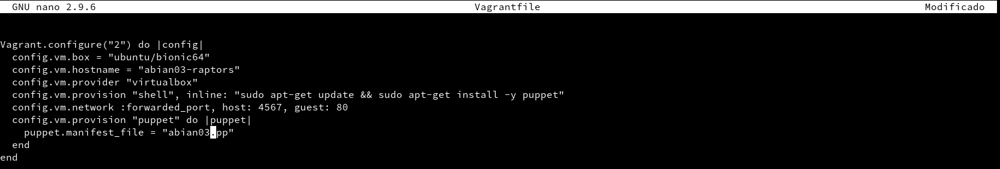

Después de esto crear la carpeta **manifests** y crearemos el fichero **manifests/abian03.pp**, con las órdenes/instrucciones Puppet necesarias para instalar el software que elijamos.

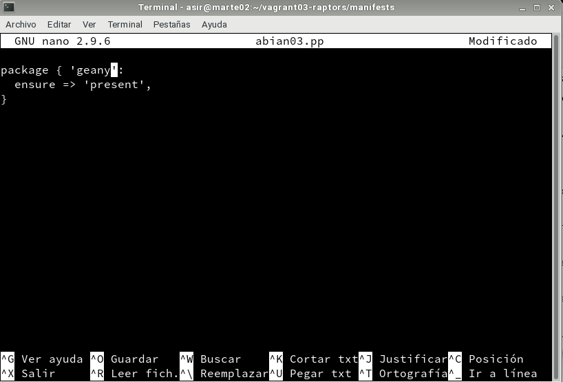

Para que se apliquen los cambios de configuración tenemos 2 caminos:

Con la MV encendida:
* vagrant reload, recargar la configuración.
* vagrant provision, volver a ejecutar la provisión.    

Con la MV apagada:
* vagrant destroy, destruir la MV.
* vagrant up volver a crearla.

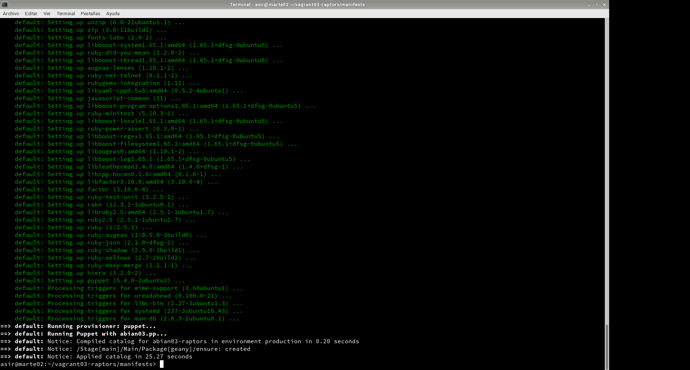

## 7. Proyecto Bulls (Nuestra caja)
### 7.2 Crear caja Vagrant

Una vez hemos preparado la máquina virtual ya podemos crear el box. Vamos a crear una nueva carpeta **vagrant03-bulls**, para este nuevo proyecto vagrant. Con el comando **VBoxManage list vms** mostraremos los nombres de nuestras MVs. Elegiremos una de las máquinas.

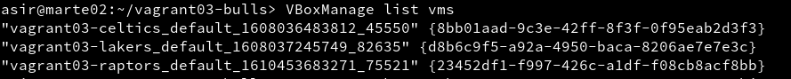

Usaremos el comando **vagrant package --base VMNAME --output nombre-alumnoXX.box**, parar crear nuestra propia caja. Comprobamos que se ha creado el fichero **abian03.box** en el directorio donde hemos ejecutado el comando.

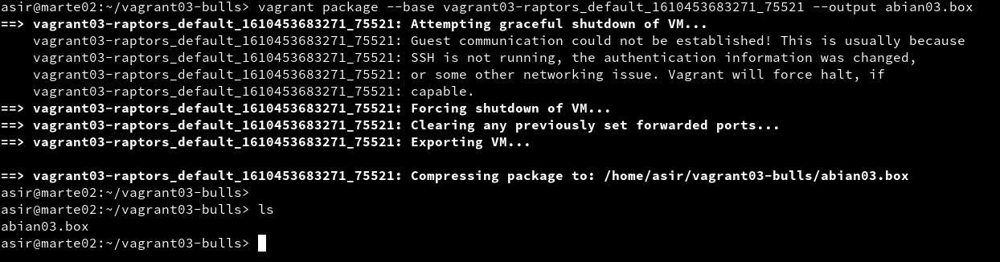

Por último con el comando **vagrant box add abian/bulls abian03.box**, añadimos la nueva caja creada por nosotros, al repositorio local de cajas vagrant de nuestra máquina y con **vagrant box list**, podremos consultar ahora la lista de cajas Vagrant disponibles.

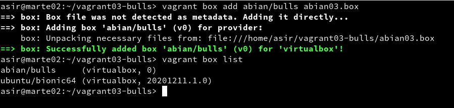
