# Práctica 8 - Docker

###### Nombre del alumno:
Abián Castañeda Méndez

## 3. Crear contenedor a partir de nuestra imagen
### 3.2 Comprobamos

Abrimos una nueva terminal. Allí usamos el comando **docker ps**, el cual nos muestra los contenedores en ejecución. Podemos apreciar que la última columna nos indica que el puerto 80 del contenedor está redireccionado a un puerto local 0.0.0.0.:PORT -> 80/tcp.

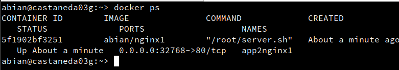

Abriremos el navegador web y pondremos **URL 0.0.0.0.:32768**. De esta forma nos conectaremos con el servidor Nginx que se está ejecutando dentro del contenedor. Comprobar el acceso a holamundo1.html.

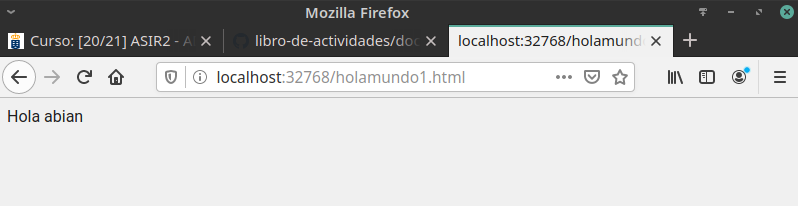

Paramos el contenedor app2nginx1 y lo eliminamos.

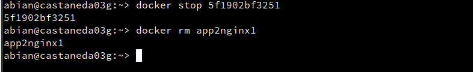

### 3.3 Migrar la imagen a otra máquina

Exportar imagen Docker a fichero tar:

* **docker save -o abian03docker.tar abian/nginx1**, guardamos la imagen "abian/nginx1" en un fichero tar. Intercambiaremos nuestra imagen exportada con la de un compañero de clase.

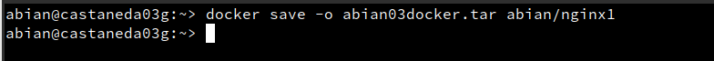

Importar imagen Docker desde fichero:

Cogemos la imagen de un compañero de clase. Nos llevamos el tar a otra máquina con docker instalado, y restauramos. Con el comando **docker load -i alumnoXXdocker.tar**, cargamos la imagen docker a partir del fichero tar.

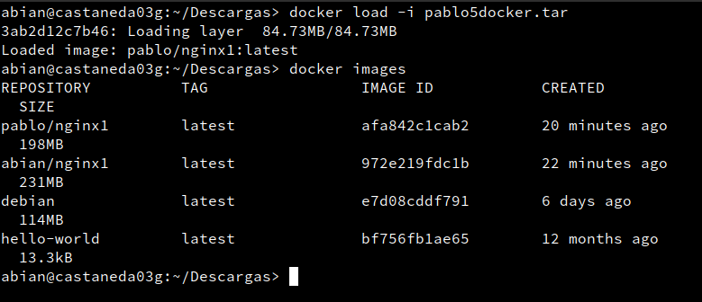

Con **docker images**, comprobaremos que la nueva imagen está disponible. Probaremos a crear un contenedor (app3alumno), a partir de la nueva imagen.

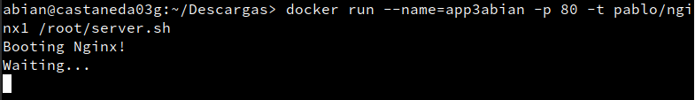

## 4. Dockerfile
### 4.2 Crear imagen a partir del Dockerfile

El fichero Dockerfile contiene toda la información necesaria para construir el contenedor. Con el comando **cd docker03a**, entramos al directorio con el Dockerfile. Tras esto con **docker build -t abian/nginx2 .**, construye una nueva imagen a partir del Dockerfile. Al poner **docker images**, debería aparecer nuestra nueva imagen.

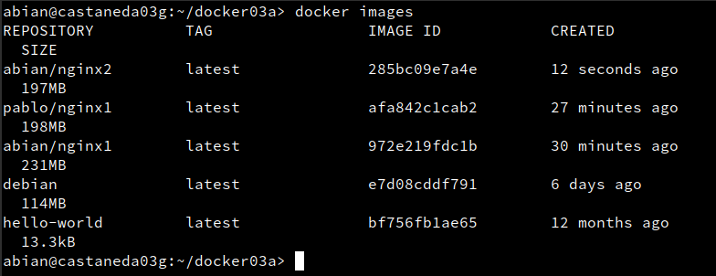

### 4.3 Crear contenedor y comprobar

A continuación vamos a crear un contenedor con el nombre **app4nginx2**, a partir de la imagen **abian/nginx2**. Probaremos con:

* **docker run --name=app4nginx2 -p 8082:80 -t abian/nginx2**

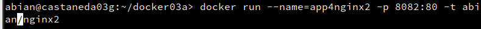


Desde otra terminal:

Usaremos **docker ps**, para comprobar que el contenedor está en ejecución y en escucha por el puerto deseado.

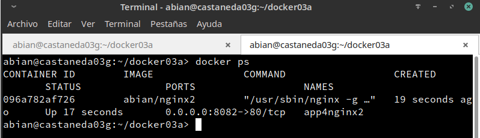

Después comprobaremos en el navegador:

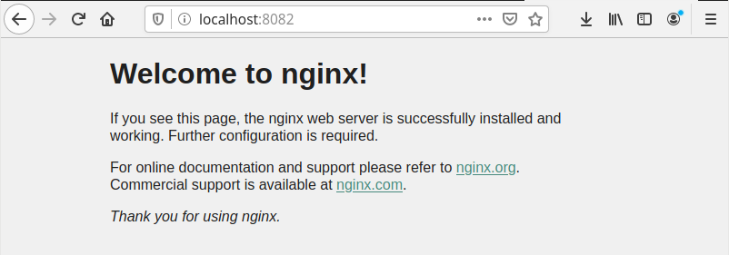

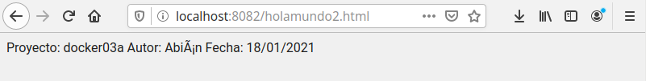

### 4.4 Usar imágenes ya creadas

En este apartado crearemos el directorio docker03b. Allí crearemos el fichero holamundo3.html con:

Proyecto: dockerXXb
Autor: Nombre del alumno
Fecha: Fecha actual

Después creaemos el un archivo Dockerfile siguiendo la guía de la práctica:

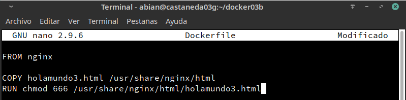

Con el comando **docker build -t abian/nginx3 .**, crearemos la imagen.

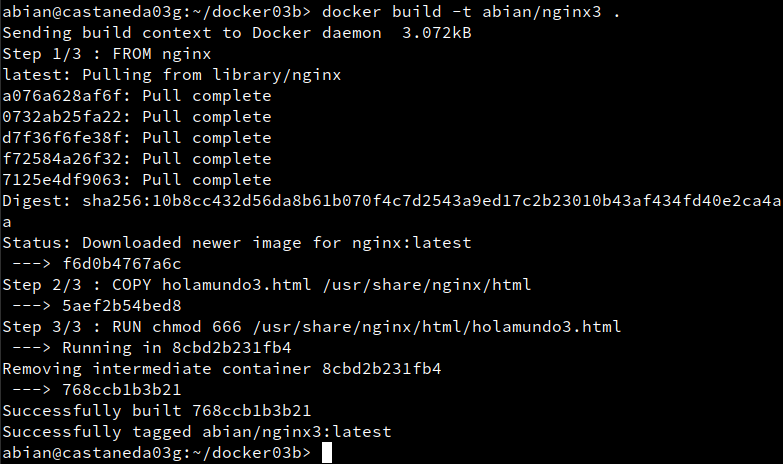

Después con **docker run --name=app5nginx3 -d -p 8083:80 abian/nginx3**, crearemos el contenedor.

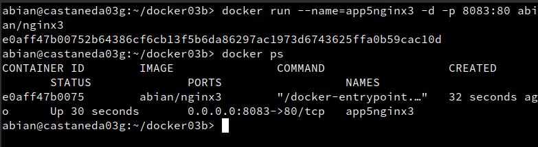

Comprobar el acceso a "holamundo3.html":

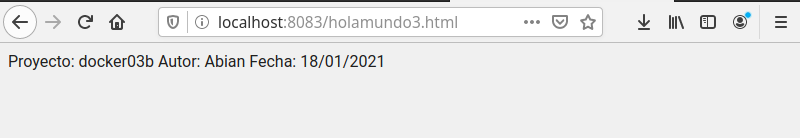

## 5. Docker Hub

Ahora vamos a crear un contenedor "holamundo" y subirlo a Docker Hub. Para ello crearemos nuestra imagen "holamundo":

Primero de todo crearemos la carpeta **docker03c**. Entrar en la carpeta. Allí crearemos un script (holamundo03.sh) con lo siguiente:

```
#"!/bin/sh
echo "Hola Mundo!"
echo "nombre-del-alumnoXX"
echo "Proyecto dockerXXc"
date
```

Crear fichero Dockerfile

```
FROM busybox
MAINTAINER nombre-del-alumnoXX 1.0

COPY holamundoXX.sh /root
RUN chmod 755 /root/holamundoXX.sh

CMD ["/root/holamundoXX.sh"]
```

A partir del Dockerfile anterior crearemos la imagen **abian/holamundo**. Comprobar que docker run **abian/holamundo** se crea un contenedor que ejecuta el script.

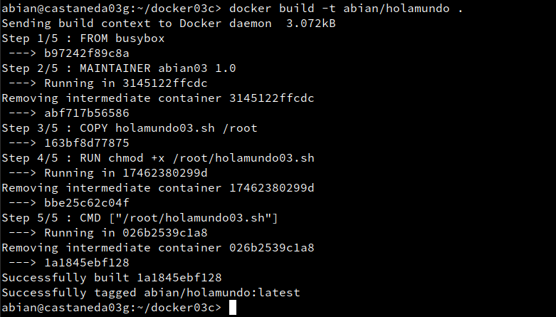

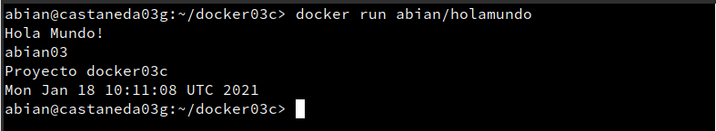

Subir la imagen a Docker Hub:

Registrarse en Docker Hub. Con el comando **docker login -u USUARIO-DOCKER**, abriremos la conexión. Con **docker tag nombre-alumno/holamundo:latest USUARIO-DOCKER/holamundo:version1** , etiquetamos la imagen con "version1". Por último con **docker push USUARIO-DOCKER holamundo:version1**, subimos la imagen (version1) a los repositorios de Docker.

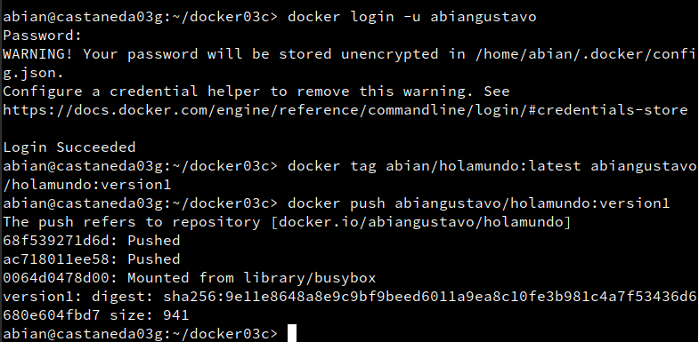


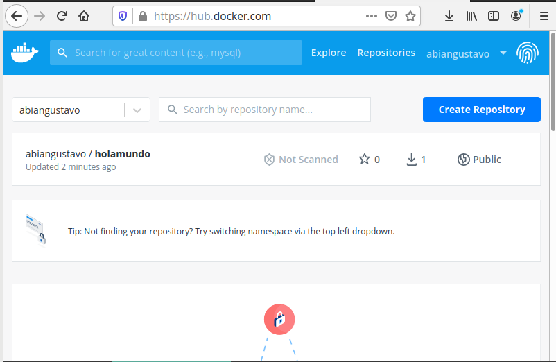
