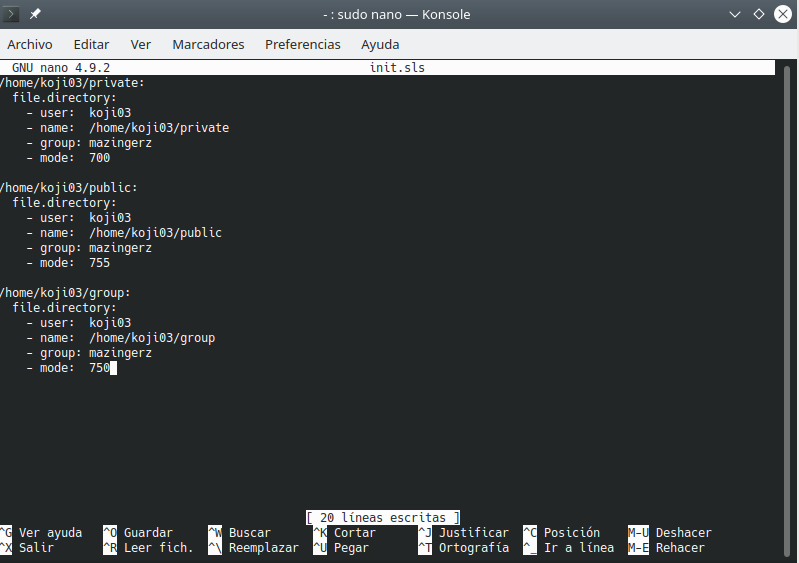

# Práctica 9 - Salt-stack

###### Nombre del alumno:
Abián Castañeda Méndez

## 3. Minion
### 3.4 Comprobamos conectividad

Desde el Máster comprobamos la conectividad y la versión de Salt instalada en los Minions.

## 4. Salt States
### 4.5 Aplicar el nuevo estado

Iremos al Master:

Allí consultaremos los estados en detalle y verificaremos que no hay errores en las definiciones:

* salt '*' state.show_lowstate

* salt '*' state.show_highstate

Con salt '*' state.apply apache, aplicaremos el nuevo estado en todos los minions.

## 5. Crear más estados
### 5.1 Crear estado "users"

Vamos a crear un estado llamado **users** que nos servirá para crear un grupo y usuarios en las máquinas Minions:

Crearemos el directorio /srv/salt/base/users. Allí crearemos fichero /srv/salt/base/users/init.sls con las definiciones para crear los siguiente:

* Grupo mazingerz y usuarios koji03, drinfierno03 dentro de dicho grupo.

Después de esto, aplicaremos el estado.

### 5.2 Crear estado "dirs"

Crearemos el estado dirs para crear las carpetas private (700), public (755) y group (750) en el HOME del usuario koji.

Por último aplicaremos el estado dirs.

